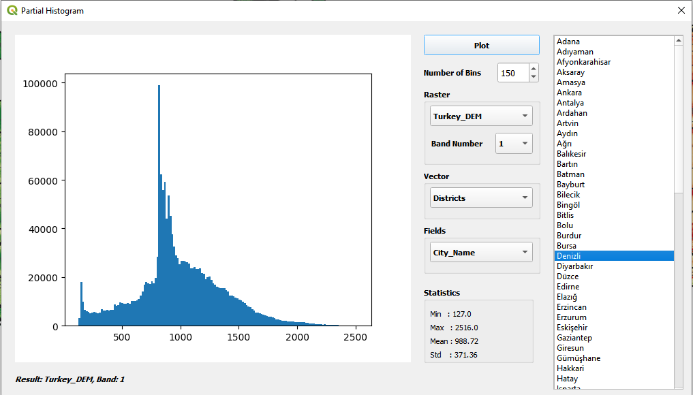

# QGIS Partial Histogram Plugin

### Installing third party Python libraries to QGIS
If you need to install opencv or matplotlib module manually, you can follow the steps below. 
1-) Open OSGeo4W Shell as an administrator, 
2-) Type py3_env in the console (This should print paths of your QGIS Python installation), 
3-) Type python -m pip install {your library} 
"python -m pip install opencv-python" 
"python -m pip install matplotlib" 
*Source:https://gis.stackexchange.com/questions/141320/installing-3rd-party-python-libraries-for-qgis-on-windows*  

This plugin creates histogram of a part of a raster. The histogram is created according to the specified polygon layer.For correct results please be sure that the layer and the canvas have same coordinate reference system.

### Some illustrative examples are shown below:
 
 
 

  

 
 

#### - The image below illustrates the histogram of "Denizli City" in "Turkey" that was created using elevation data.

 
 

#### - The image below illustrates the histogram of "Denizli City", but this time the "Districts" data and its "City" attribute was used. The "districts" are dissolved by "city name".

